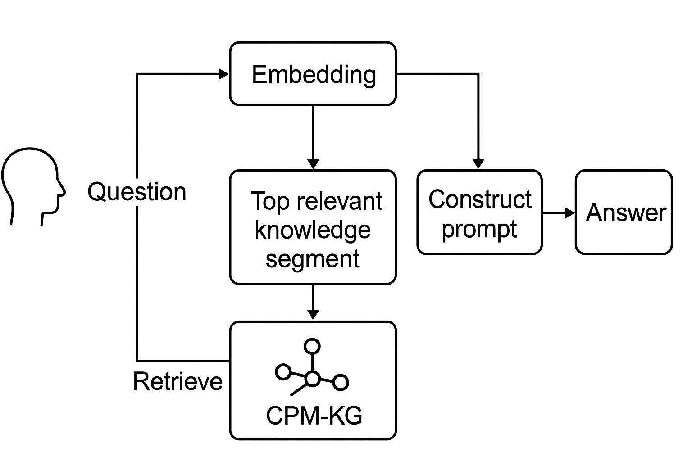

### 1. 论文概要

- **主题**：在建筑工程项目管理（CPM）领域，利用**多模态领域知识图谱（CPM-KG）**增强**大语言模型（GLM）**的问答能力。
- **核心目标**：解决现有CPM问答中知识库规模小、方法落后（基于语法规则或小模型）、缺乏测试集的问题。
- **主要成果**：
  - 构建了覆盖36个CPM子领域的多模态知识图谱（文本+图片）。
  - 与8个主流GLM结合（包括GPT-4、GPT-4-turbo、ERNIE-Bot 4.0等）。
  - 开发了2435道CPM问答测试集（来源于2013–2023年中国注册建造师考试）。
  - 实验证明CPM-KG增强后平均准确率提高30%，在多选题、图片题、跨子领域题目上提升更显著。

------

### 2. 研究内容

- **知识图谱构建**：
  - 三层结构：一级（主领域）、二级（7个大类）、三级（36个子领域）。
  - 收集195份CPM法规/标准文件（含2.6百万字和339张图片）。
  - 存储在Neo4j，提供JSON/向量化格式以便复用。
- **测试集构建**：
  - 2435道多选/单选题，标注题目来源年份、子领域、是否含图片等。
  - 发布在HuggingFace，供后续研究评测使用。
- **实验对象**：
  - 8个GLM（ChatGLM3-6B、GPT-3.5、GPT-4、GPT-4-turbo、ERNIE-Bot、ERNIE-Bot 4.0、Qianfan-Llama2、Llama-2-70B）。
  - 测试四种维度：不同年份、不同子领域、单/多选题、纯文本/图片题。
- **实验流程**
  - 

------

### 3. LangChain RAG框架

- **RAG三阶段集成**（论文明确指出使用**LangChain RAG框架**）：
  1. **知识向量化**：
     - 将CPM-KG拆分成250 token片段（50 token重叠），用Dmeta-embedding-zh模型做向量化。
  2. **相似知识检索**：
     - 将用户问题向量化后计算余弦相似度，选取Top-3最相关知识片段。
  3. **构建Prompt并提交GLM**：
     - 不同模板分别用于单选题和多选题（严格按选项输出）。
     - 将问题+检索到的知识插入prompt，送入GLM生成答案。
- **多模态处理**：
  - 对图片题，将图片转成文本描述（在知识图谱中用占位符+云存储URL），使GLM可以处理“图文混合”题目。
- **性能评测**：
  - 精度、召回率、F1-score和准确率（AR）。
  - 用Wilcoxon符号秩检验做显著性分析。

------

### 4. 与RAG的相关性

- **直接相关**：论文明确指出“formulating a three-stage CPM-KG and GLM integration process via **Retrieval-Augmented Generation (RAG)**”。
- 采用的是典型RAG架构：向量化知识库 → 检索相关片段 → 拼接Prompt → 输入GLM。
- 论文还特别强调RAG在提高可解释性、减少幻觉、增强领域知识注入等方面的作用。
- 对于你的RAG问答项目，论文提供了**可复用的完整流程**（知识库构建+向量化+检索+Prompt模板+测试集）。

------

### 5. 对你后续RAG知识问答项目的启示

- **知识库**：先有结构化/半结构化知识源，再转为向量数据库。
- **多模态**：若未来问答涉及图表/图像，可参考论文的图片→文本转化方法。
- **Prompt模板**：针对不同题型/任务设计不同模板，提高精度。
- **可解释性**：在输出答案时同时展示检索到的知识片段。
- **评测**：提前构建或引入一个标准化测试集，便于横向比较不同模型或不同参数配置。

------

**一句话总结**：
 这篇论文就是把“领域多模态知识图谱”通过**RAG框架**与大模型结合，大幅提升建筑工程项目管理领域的问答能力——它本身就是一个典型的**RAG增强大模型**案例。

### 6. RAG的四种方法对比

#### ① 直接用知识图谱原始结构去生成提示词

**优点**

- 能保留知识的结构化、语义关系，便于推理。
- 可以做图谱级别的关系检索与推断，不只限于文本匹配。

**缺点**

- 前期构建和维护知识图谱成本高（领域专家+Neo4j或RDF）。
- 原始图谱三元组通常不适合作为大模型上下文，需要先转文本化，否则 prompt 会过碎或不自然。
- 如果文档是 PDF 格式，需要先做大量抽取、结构化，工作量大。

**适用场景**

- 知识高度结构化、关系复杂、实体和属性非常清晰的行业（如药物研发、供应链）。

------

#### ② 直接文档库检索匹配相关内容生成提示词（纯文本RAG）

**优点**

- 技术成熟、实现简单，向量化 + 余弦相似度即可。
- 可快速覆盖大量PDF，不需要专家手工建图谱。
- 更新知识库容易（新增PDF直接embedding）。

**缺点**

- 只能检索出局部段落，缺少跨段落、跨文档的关联性。
- 无法利用知识之间的结构化关系（上下位、因果、约束等）。
- 对于知识点分布在不同文档时，拼接上下文容易缺漏。

**适用场景**

- 规范性文件、技术规程、规章制度，尤其是PDF占主体且格式各异时。

------

#### ③ 知识图谱 + 传统文档库混合检索并行跑

**优点**

- 图谱部分提供结构化知识；文档库提供非结构化细节。
- 可以双通道检索，互补优势；更丰富的上下文。
- 适合知识密集、关系复杂，但原始文档又很多的行业。

**缺点**

- 架构复杂，需同时维护图谱和文本库；检索逻辑、权重融合需要调优。
- 对硬件资源要求更高。
- 对提示词拼接和长度控制要精心设计。

**适用场景**

- 行业内有成熟图谱或已知概念体系，同时又有大量非结构化文本。

------

#### ④ 论文中的方法（基于知识图谱构建 → embedding → RAG → Prompt）

（即多模态CPM-KG + RAG + 大模型）

**优点**

- 保留图谱的结构化知识，同时通过向量化接入RAG体系，大模型接收的是高质量、去冗余的知识段落。
- 支持多模态（文本+图），可解释性强。
- 实证结果显示可显著提升准确率、召回率和F1（论文提升30%左右）Augmenting general-purpose larg…。
- 向量化后检索速度和成本比直接GLM检索低。

**缺点**

- 前期构建图谱及向量化成本较高（抽取三元组、分层分类、Neo4j存储等）。
- 对更新机制有要求，否则图谱陈旧。
- 部署维护比纯文本RAG复杂。

**适用场景**

- 已经有较稳定的知识体系、能投入资源构建知识图谱、追求高准确率/解释性的领域。

------

#### 项目背景下的建议

> **背景**：本地知识库基于大量 PDF（矿业安全规程、检验规范、技术规范、勘察规范等），以法规、标准、规范性文件为主。

特点：

- 以文本为主，结构化程度低；
- 行业规范相对固定、更新周期长；
- 重点是高准确率、快速落地。

**建议**：

- **短期落地**：选择 **② 直接文档库检索（纯文本RAG）** 最合适，投入低、上线快、维护方便，能快速覆盖PDF。
- **中长期优化**：如果你能梳理出标准条款、章节和关系，逐步建设轻量图谱，可以演进到 **④ 论文中的方法**（即先建一个行业知识框架，再embedding+RAG），这样准确率和解释性更好。
- **不建议**一开始就上①纯图谱，工作量太大；③混合检索需要双维护，成本更高。

因此：

- **第一阶段**：用embedding+RAG处理所有PDF，实现问答系统。
- **第二阶段**：在RAG基础上补充知识图谱（章节、条款、上下位关系），逐步演进成论文那种“KG+RAG”架构。

这样既兼顾快速上线，又为后续精细化、结构化奠定基础。